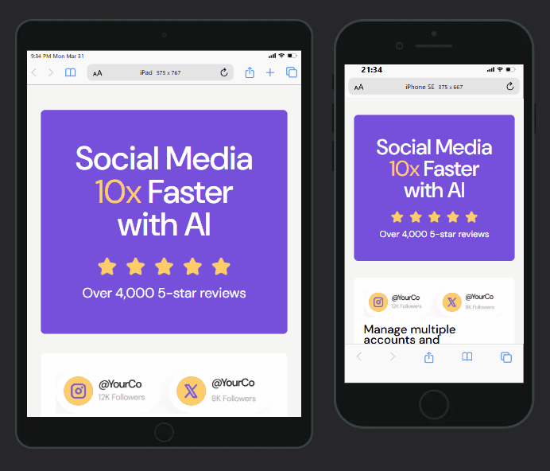

# Bento Grid | Desafio do Frontend Mentor

## **Sumário**

- [Visualização do Projeto](#visualização-do-projeto)
- [Apresentação](#apresentação)
- [Explicação do Projeto](#explicação-do-projeto)
- [Estrutura do Projeto](#estrutura-do-projeto)
- [Como Utilizar o Código do Projeto](#como-utilizar-o-código-do-projeto)
- [Ferramentas e Tecnologias Utilizadas](#ferramentas-e-tecnologias-utilizadas)
- [Principais Recursos e Abordagens](#principais-recursos-e-abordagens)
- [Desafios Enfrentados](#desafios-enfrentados)
- [Aprendizado Adquirido](#aprendizado-adquirido)
- [Desenvolvimento Contínuo](#desenvolvimento-contínuo)
- [Agradecimentos e Conclusão](#agradecimentos-e-conclusão)
- [Contato](#contato)
- [Licença de Uso](#licença-de-uso)

## **Visualização do projeto**

### **🖥️ Desktop**

<div>
  
</div>

### **📱 Mobile**

<div>
  
</div>

### [Acesse a página clicando aqui!](https://miguel-dalmeida.github.io/bento-grid_project/) 


## **Apresentação**  

Olá! Me chamo Mário Miguel e sou estudante de Desenvolvimento Web. Atualmente, faço parte do curso **DevQuest**, da *Dev em Dobro*, focado na formação de desenvolvedores Fullstack.  

Como parte do meu aprendizado, recriei o desafio ***Bento Grid*** do *Frontend Mentor*. Esse desafio faz parte do meu projeto [**Lapidando HTML e CSS**](https://gigantic-chef-a6f.notion.site/Lapidando-HTML-e-CSS-1a4cd10b93ab8081a48cf19eeef02d02?pvs=73), que criei para aprimorar minhas habilidades práticas em HTML e CSS.  

O projeto consiste em quatro desafios do *Frontend Mentor*, escolhidos a dedo para acompanhar a evolução do meu aprendizado. **A cada novo desafio, o nível de complexidade aumenta, me preparando gradualmente para iniciar meus estudos em JavaScript ao término da lapidação.**

## **Explicação do Projeto**  
O ***Bento Grid*** é o terceiro desafio do programa **Lapidando HTML e CSS**, criado para reforçar meu domínio em *CSS Grid* de forma prática.  

Trata-se de uma landing page com estética moderna e chamativa, projetada para promover uma inteligência artificial fictícia voltada à automação de conteúdos para redes sociais. A estrutura da página é baseada num layout de grade composto por 8 cards irregulares organizados numa espécie de contêiner central. Cada card destaca uma funcionalidade específica dessa IA. **Dentre elas, posso citar:**  

- Criação rápida de conteúdo;  
- Gerenciamento de múltiplas contas e plataformas;  
- Agendamento inteligente de postagens;  
- Otimização do engajamento e crescimento de seguidores.  

O design apresenta uma estética bem vibrante, com tons predominantes em roxo e amarelo.  

#### **Atenção**  
Se quiser praticar HTML e CSS, experimente recriar esse projeto por conta própria! Basta acessar o link abaixo para conferir o desafio no *Frontend Mentor*:  
🔗 [Bento Grid](https://www.frontendmentor.io/challenges/bento-grid-RMydElrlOj)

## **Estrutura do Projeto**

```plaintext
├── src/
│   ├── css/
│   │   ├── reset.css
│   │   ├── styles.css
│   │   ├── responsive.css
│   ├── images/
│   │   ├── ...
│   ├── js/
│   │   ├── script.js
├── index.html
├── README.md
```

## **Como Utilizar o Código do Projeto**

**Para rodar este projeto em sua máquina local, siga os passos abaixo:**

### 1️⃣ Crie um diretório para o projeto  
Escolha um local no seu computador e crie uma pasta para armazenar os arquivos do projeto.

### 2️⃣ Acesse o terminal  
Clique com o botão direito sobre a pasta criada e selecione a opção para abrir o terminal.  

### 3️⃣ Clone o repositório  
No terminal, execute o seguinte comando para clonar o repositório:  
```sh
git clone https://github.com/Miguel-dAlmeida/bento-grid_project.git
```
### 4️⃣ Acesse o diretório do projeto
Após a clonagem, entre na pasta do projeto executando o comando abaixo em seu terminal:

```sh
cd bento-grid_project
```

### 5️⃣ Abra o projeto no editor de código
Ainda no terminal, caso esteja utilizando o VS Code, basta rodar o comando:

```sh
code .
```
Se estiver utilizando outro editor, abra a pasta `bento-grid_project` manualmente no programa de sua escolha.

**Pronto! Agora você pode explorar e editar o código do projeto.** 

## **Ferramentas e Tecnologias Utilizadas**

<div style="display: inline_block" align="center"><br>
  
  
  
  
</div>

## **Principais Recursos e Abordagens**

- **Tags semânticas**: Utilização de tags semânticas como `<main>`, `<section>` e `<footer>`, entre outras, para garantir uma melhor estruturação do conteúdo e facilitar a acessibilidade e a indexação por mecanismos de busca (SEO).

- **Pré-carregamento de recursos essenciais**: Implementação do atributo `link rel="preload"` para os recursos críticos, especificamente a imagem da seção `.hero` e a fonte do Google Fonts. Essa abordagem de otimização de desempenho permite que o navegador priorize o download desses recursos antes de serem requisitados diretamente na renderização, reduzindo o tempo de carregamento da página e melhorando a experiência do usuário. 

- **Resets CSS**: O uso de um arquivo de *Reset CSS* para normalizar a aparência dos elementos.

- **Fonte do Google Fonts**: Inclusão da fonte *DM Sans*.

- **Abordagem Desktop First**: A aplicação foi desenvolvida seguindo o padrão *Desktop First*, priorizando inicialmente o design e a estrutura para dispositivos como computadores e notebooks. Posteriormente, a interface foi progressivamente ajustada para garantir a adaptação e usabilidade em telas menores, como smartphones e tablets.

- **Organização lógica de propriedades CSS**: Adotei uma convenção estruturada para a organização das propriedades CSS, fundamentada em critérios sólidos e amplamente aceitos pela comunidade de desenvolvimento front-end. Essa abordagem foi criada a partir de análises específicas que serão detalhadas nas próximas seções, promovendo maior legibilidade, consistência e previsibilidade no código.

- **Nesting CSS**: Utilizei a metodologia Nesting CSS para organizar as regras de estilo de forma hierárquica e intuitiva. Essa abordagem permitiu simplificar o código, reduzindo redundâncias e tornando a estrutura mais fácil de ler e manter.

- **CSS Flexbox**: Aplicação do *Flexbox* para a disposição e alinhamento de elementos.

- **CSS Grid**: Estruturação do layout utilizando o sistema de grades do CSS Grid, permitindo uma organização mais eficiente e responsiva dos elementos da interface.

- **Pseudo-classes**: Utilização da pseudo-classe `:hover`.

- **Unidades de medida relativas com `min()` e `max()`**: Aplicação das funções `min()` e `max()` para ajustar dinamicamente o tamanho das fontes conforme as dimensões da tela, eliminando a necessidade de múltiplos breakpoints. Essa técnica reduz a complexidade do código, garantindo que as fontes se adaptem de maneira fluida e automática à largura do dispositivo.


- **Media Queries**: Aplicação de media queries para garantir que o layout se adapte adequadamente a diferentes tamanhos de tela.

- **Responsividade Condicional**: Implementação de media queries com condicionais, como `(orientation: portrait)`, para aplicar estilos específicos conforme a orientação da tela e outras características do dispositivo.

- **Prefixos `-webkit-`, `-ms-` e `-o-`**: Inclusão de prefixos em propriedades CSS para garantir compatibilidade com versões antigas de navegadores.  
***Nota:** Utilizei o site [Autoprefixer CSS online](https://autoprefixer.github.io/) para incluir os prefixos automaticamente.*

- **Utilização de JavaScript em auxílio ao visual da página**: Foi implementada uma função JavaScript para monitorar a presença de scroll vertical na página. A lógica verifica se a altura total do conteúdo excede a altura da janela, adicionando ou removendo dinamicamente a classe `no-scroll` no elemento `.site-footer`. Essa abordagem me permite adicionar estilos específicos para telas sem scroll vertical.


## **Desafios Enfrentados**

No README do projeto anterior ([Repositório | Product Preview Card Component](https://github.com/Miguel-dAlmeida/product-preview-card-component_project)), mencionei que estava um pouco receoso com este desafio, pois ainda me sentia inseguro com CSS Grid. E, como previsto, estruturar o layout foi um verdadeiro quebra-cabeça.

**Iniciando pela versão desktop**, tentei definir alturas fixas para as células da grade, o que eliminou o scroll vertical e manteve todo o conteúdo visível de uma vez. No entanto, a disposição dos elementos ficou caótica, principalmente os textos. Como a altura dos contêineres não se ajustavam dinamicamente, era necessário que as fontes e imagens se redimensionassem perfeitamente conforme a tela variava. Testei funções como `min()`, `max()`, `clamp()` e unidades relativas como `vw`, mas sem sucesso.

Diante disso, percebi que um cálculo preciso com `clamp()`, `vw` e `vh` poderia ser a solução, mas ainda não tinha experiência suficiente para aplicá-lo com assertividade (vale ressaltar que também não encontrei nenhum conteúdo na internet que se aprofundasse nessa temática). Assim, optei por utilizar alturas automáticas na grade (`grid-template-rows: auto;`) e controlar os textos com `min()` + `vw`. Isso resultou na necessidade de um scroll vertical, mas facilitou a adaptação das fontes e garantiu um layout fiel ao design proposto pelo Frontend Mentor. Além disso, como utilizei `min()` e `vw` para `font-size` e `line-height`, além de `%` para espaçamentos e imagens, a responsividade se ajustou naturalmente, dispensando breakpoints.    

Outro ponto interessante foi a abordagem para telas menores. Enquanto em *desktop* usei `min()` + `vw` para ajustar o tamanho das fontes, em dispositivos móveis adotei `max()` + `vw`, garantindo um tamanho mínimo fixo que aumentava conforme a tela se expandia — o oposto do que fiz para *desktop*. Foi gratificante aplicar esse conhecimento, adquirido no projeto anterior, e perceber que essa estratégia reduziu significativamente o tamanho do código, exigindo apenas um *breakpoint* para adaptar o design ao mobile.  

Outro desafio enfrentado foi a responsividade das imagens que transbordam seus contêineres, especificamente a imagem `illustration-consistent-schedule.webp` da seção `.feature-timeline` (no design mobile, essa imagem transborda levemente para baixo do contêiner — transbordamento que é omitido por `overflow: hidden;`). No processo de adaptação do layout para telas *mobile*, tentei ajustar a imagem usando `padding-bottom` proporcional e posicionamento absoluto, mas isso gerava inconsistências conforme a tela variava: ou sobrava muito espaço ou a imagem invadia o texto.  

A solução veio ao lembrar de um aulão da **Masterclass Responsividade na Prática** da *Rocketseat*, que assisti enquanto aguardava a correção de um projeto no curso Dev Quest ([Repositório | Huddle Landing Page](https://github.com/Miguel-dAlmeida/huddle_landingpage_project)). A técnica ensinada lá consistia em envolver a imagem em um contêiner extra e aplicar o `padding` nele, em vez do contêiner principal. Revendo minhas anotações, percebi que essa abordagem resolveria o problema e a implementei com sucesso. **Veja abaixo a solução que utilizei:**

- **Código CSS:**  
```css 
   .feature-timeline {
        position: relative;

        padding: 6% 6% 0 6%;

        & h2 {
            margin-bottom: 4%;

            font-size: max(6.3vw, 2.5rem);
            line-height: max(6.3vw, 2rem);
        }


          /* AQUI ESTÁ:*/
        & .image {
            position: relative;

            width: 100%;

            padding-bottom: 45%;

            & img {

                position: absolute;
                bottom: -10%;

                width: 65%;
            }
        }
    }
```

- **Gif da seção:**  
<div align="center">
  
</div>

Perceba que a imagem não sobrepõe elementos vizinhos nem cria "buracos" em seu contêiner, e sim se adapta perfeitamente. 


## **Aprendizado Adquirido**  

### **Footer: Melhor uso da marcação `<small>`**  
Aprendi que a tag `<small>` é estrutural e semanticamente mais adequada do que `<footer>` para envolver informações secundárias, como créditos, direitos autorais, *disclaimers* ou notas de rodapé. Ao aplicá-la nos créditos no final da página, melhorei a semântica da minha aplicação.  

### **Revisão e Consolidação dos Conceitos de CSS Grid**  
Antes de começar a codificação, revisei minha página de anotações sobre CSS Grid ([CSS Avançado - Parte 3 (Grid)](https://www.notion.so/CSS-avan-ado-Parte-3-Grid-13bcd10b93ab8073a22ae85561991dab)), que reúne resumos de aulas, insights da IA e trechos de documentações. Isso me ajudou a reforçar a teoria e, durante a implementação, pude consolidar esse conhecimento com a prática, ganhando mais experiência na construção de layouts em grade.  

### **Organização de Propriedades CSS**  
Para manter meu código mais organizado e legível, pesquisei convenções sobre a ordem ideal de declaração das propriedades CSS. Após algumas pesquisas, desenvolvi, com a ajuda da IA Claude.IA, um padrão lógico que segui no projeto:  

1. **Posicionamento:** `position`, `top`, `right`, `z-index`, etc.  
2. **Dimensão:** `display`, `width`, `height`, etc.  
3. **Modelo de Caixa:** `margin`, `border`, `box-sizing`, etc.  
4. **Tipografia:** `font-family`, `font-size`, `font-weight`, `line-height`, `color`, etc.  
5. **Fundo e Estilo Visual:** `background`, `background-color`, `opacity`, `border-radius`, etc.  
6. **Flexbox/Grid:** `display: flex | grid`, `flex-direction`, `justify-content`, etc.  
7. **Transições e Animações:** `transition`, `animation`, etc.  

Esse método deixou meu código mais fácil de ler e de "dar manutenção".  

### **Lidando com Recursos Críticos**  
Aprendi a usar o atributo `rel="preload"` para otimizar o carregamento da página. Esse recurso instrui o navegador a baixar um elemento essencial o mais rápido possível, antes mesmo de ser necessário na renderização. Apliquei essa técnica na imagem da `.hero` e no principal link da fonte do projeto, o que:  

- Reduziu o tempo de carregamento inicial  
- Priorizou o download de elementos essenciais  
- Melhorou a experiência visual do usuário  
- Diminuiu o tempo percebido de carregamento  

### **Lidando com Imagens Abaixo da Dobra**  
Todas as imagens do projeto, exceto a da `.hero`, em algum momento não estarão visíveis de imediato. Para otimizar o desempenho do site e melhorar a experiência do usuário, apliquei o atributo `loading="lazy"` nelas. Isso faz com que sejam carregadas apenas quando estiverem prestes a entrar na área visível da tela, reduzindo o uso de banda e acelerando o carregamento da página.  

### **Atenção**  
Para explorar tudo que aprendi, clique no link abaixo e procure por ***Conhecimento Adquirido: Bento Grid***. Lá, você será direcionado para a página do Notion que reúne as anotações do programa **Lapidando HTML e CSS**.  
🔗 [Lapidando HTML e CSS | Anotações no Notion](https://gigantic-chef-a6f.notion.site/Lapidando-HTML-e-CSS-1a4cd10b93ab8081a48cf19eeef02d02)

## **Desenvolvimento Contínuo**  

Com a conclusão deste projeto, sigo para o próximo desafio: **Huddle Landing Page With Alternating Feature Blocks**, também do *Frontend Mentor*. Enquanto o ***Bento Grid*** teve um foco mais específico e restrito ao **CSS Grid**, este novo projeto abrange e testa todos os conceitos que venho praticando até agora.  

O **Huddle Landing Page With Alternating Feature Blocks** será o último desafio do programa *Lapidando HTML e CSS*. Como mencionei na seção de Apresentação deste README, minha ideia sempre foi aumentar gradativamente o nível de complexidade a cada projeto. Agora, estou diante do maior desafio até o momento: essa landing page é a aplicação mais completa e exigente que me propus a desenvolver sozinho. Ela reunirá diversos conceitos e demandará um bom tempo de codificação, tornando-se um marco importante na minha trajetória. Estou ansioso para encarar essa etapa e finalmente recriar uma aplicação mais robusta.  

Após finalizar esse projeto, dedicarei um tempo para revisar e aprofundar meu entendimento dos códigos e anotações dos desafios que compõem o programa *Lapidando HTML e CSS*. Esse estudo servirá como um fechamento dessa fase e preparação para a próxima etapa da minha jornada: iniciar meus estudos em **JavaScript**, começando pelo módulo básico do curso *DevQuest*.  


## **Agradecimentos e Conclusão**

Se você chegou até aqui, meu sincero obrigado por dedicar seu tempo a explorar este projeto e acompanhar minha jornada. Completar esse desafio foi uma grande conquista, e cada passo reforça minha certeza de que estou no caminho certo para conquistar minha primeira vaga como desenvolvedor web júnior.

Também não posso deixar de agradecer ao [**DevQuest**](https://www.youtube.com/@DevemDobro), curso do qual sou aluno, por todo o suporte e conhecimento ensinado ao longo da minha jornada.  

<div align="center">
      <a href="https://www.youtube.com/@DevemDobro">
        
      </a>
</div>
<br>

Um grande abraço e até o próximo projeto. **Bora codar!**

## **Contato**

 <div style="margin-bottom: 20px;">
    <a style="padding-right: 3px;" href="https://www.linkedin.com/in/mariomigueldealmeida/"></a>
    <a href="mailto:mariomigueldealmeida@gmail.com"></a>
  </div>

## **Licença de Uso**  

Este código está disponível exclusivamente para fins educacionais. Qualquer outro tipo de utilização não está autorizada.   

<br>
<div align="center">
  
</div>